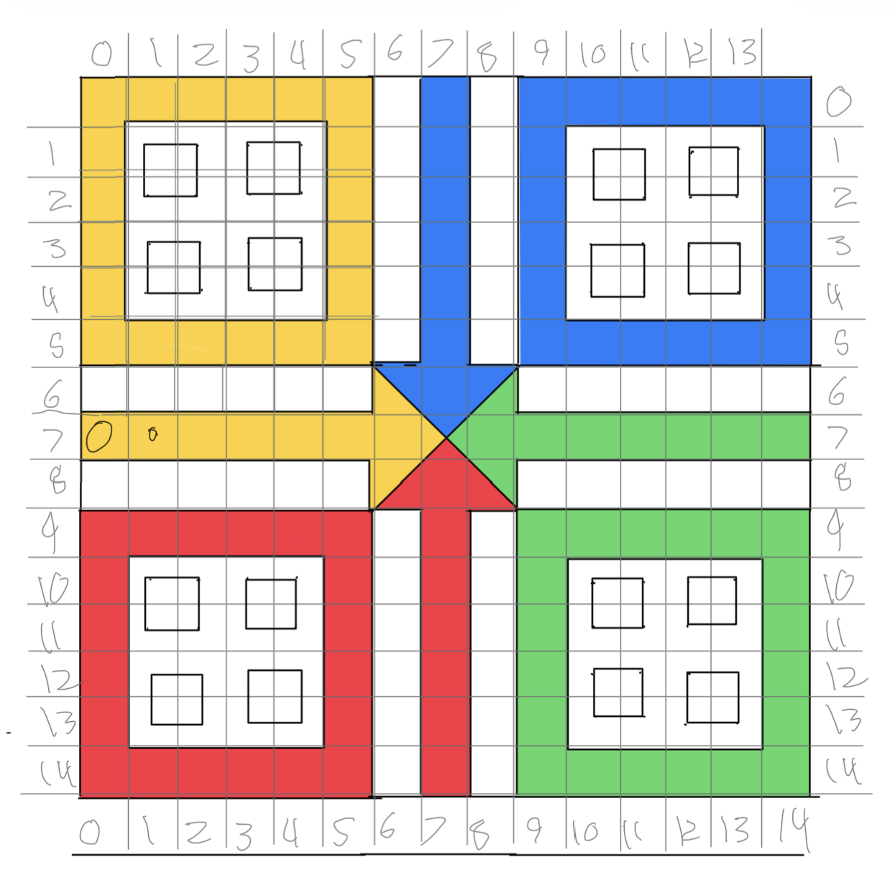
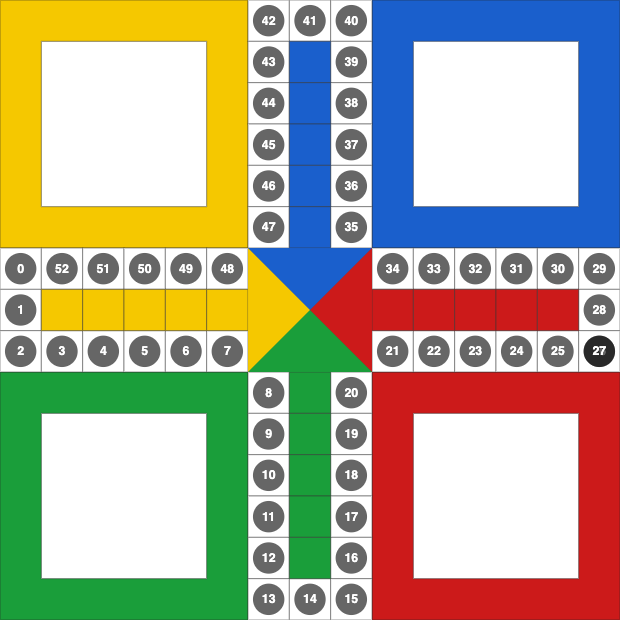
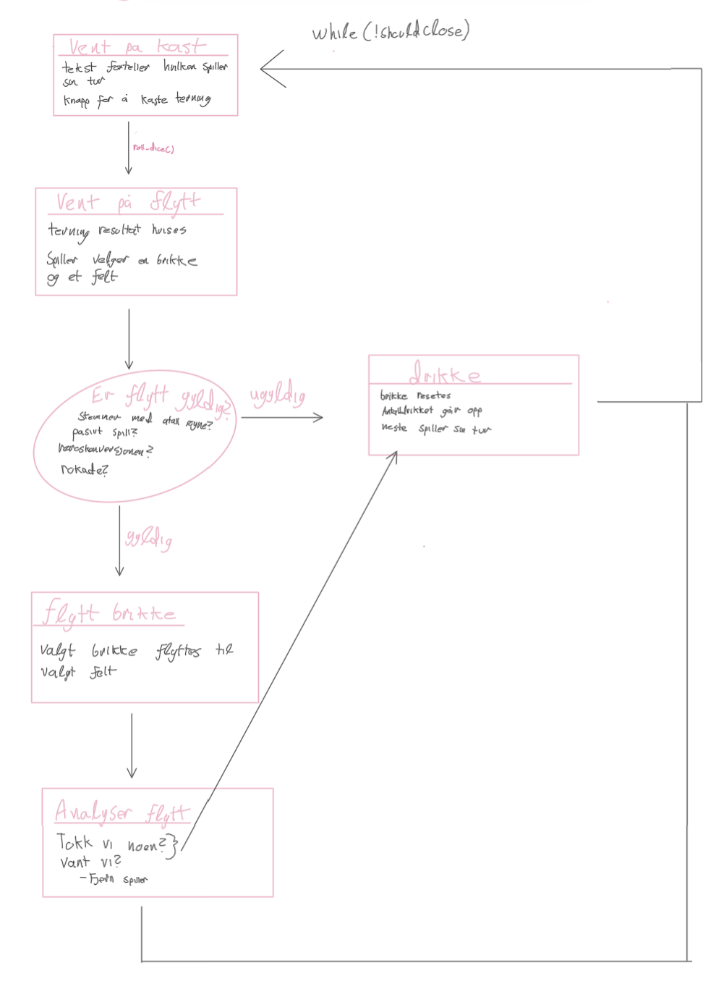

# Ludøl — Dokumentasjon

## Hva er Ludøl?

Jeg har lagd en digital versjon av drikkespillet Ludøl, bygget i C++ med det grafiske biblioteket TDT4102/AnimationWindow. Ludøl har vært en tradisjon på kjellerne på moholt i mange år.

Spillet er basert på Ludo, men med tilleggsregler rundt drikkestraffer. En innebygd dommer overvåker spillernes trekk og deler ut straffeslurker for passivt spill. Spillere går ut etter at de har spydd tre ganger. Dette er løst med at man trykker på en knapp, når en spiller spyr.

Spillet støtter fire spillere (Gul, Blå, Rød, Grønn) som spiller på samme maskin med drag-and-drop av brikker. Spilltilstanden kan lagres til fil og lastes inn igjen senere.

---

## Filstruktur og innhold

### `main.cpp`
Inngangspunktet til programmet. Oppretter et `LudolWindow`-objekt med vindusstørrelse og tittel, og starter spilløkken med `play()`.

### `player.h` / `player.cpp`
Definerer datastrukturene for spillet:

- **`Piece`** — representerer én spillbrikke. Holder styr på brikkens posisjon (`path_index`), antall steg tatt (`steps_made`), om den er på startfeltet (`home_start`), i målløypa (`home_end`), om den har fullført en runde (`oneround`), og om den står i en rokade (`rokade`). Har en `reset()`-funksjon som setter brikken tilbake til start.
- **`Player`** — representerer én spiller. Inneholder navn, farge, spillernummer, fire brikker, antall ganger drukket, antall ganger spydd, og om spilleren er ute av spillet (`gameOver`).

Hver spiller starter med fire brikker på sitt hjemmefelt. Startposisjonene bestemmes av `START_OFFSETS`-arrayen basert på spillernummer.

### `LudolWindow.h` / `LudolWindow.cpp`
Hovedklassen som arver fra `AnimationWindow` og inneholder all spillogikk og tegning.

**Brettet og koordinater:**
Spillbrettet er definert som et 15×15 rutenett. Her er en tegning som hviser hvordan kordinatene fungerer.

Kordinatene til vikitge ruter lagres i blant annent `BOARD_PATH`, som er en vektor med 52 celler som utgjør banen rundt brettet. `HOME_START` definerer startposisjonene inne i hvert hjørne, og `HOME_END` definerer målløypene inn mot midten

**Viktige funksjoner og spill logikk:**

- `play()` — hovedspilløkken. Kjører i en `while`-løkke til vinduet lukkes. Hvert frame tegnes brettet, brikker, info-tekst og poeng. Håndterer også drag-and-drop og fanger exceptions.
- `roll_dice()` — kaster terningen (tilfeldig 1–6). Hvis spilleren ikke har brikker på brettet og ikke kastet 1 eller 6, får de opptil tre forsøk. Etter tre mislykkede kast går turen videre.
- `handle_drop()` — kalles når spilleren slipper en brikke. Validerer trekket: sjekker at riktig spiller flytter, at antall steg matcher terningen (inkludert røros-konversjonen der kast K gir enten K eller 7−K steg), at brikker fra start kun flyttes med 1 eller 6, og at brikken ikke hopper over eller lander på en fiendtlig rokade.
- `flytt_brike()` / `flytt_brike_struct()` — flytter en brikke det angitte antall steg. `flytt_brike_struct()` er en ren funksjon som returnerer en kopi av brikken etter flytting, brukt til simulering. `flytt_brike()` oppdaterer den faktiske spilltilstanden.
- `updateAfterMove()` — oppdaterer rokade-status etter hvert trekk. To brikker som står på samme felt danner en rokade, som blokkerer andre spillere fra å passere eller lande der.
- `invalidMove()` — kalles ved ugyldig trekk. Øker spillerens drikketeller, resetter brikken til start, og viser en melding.
- `has_pieces_on_board()` — sjekker om en spiller har brikker ute på brettet (ikke på start eller i mål).
- `hopp_til_neste_spiller()` — bytter til neste spiller som ikke er ute av spillet.
- `player_spydde()` — registrerer at en spiller har spydd. Etter tre spyinger settes alle brikkene tilbake og spilleren er ute (`gameOver = true`).

Her er en tegning av hvordan funskjonene jobber sammen og spill logikken funker

**Tegning:**

- `draw_board()` — tegner selve Ludo-brettet med hjørneområder, banestriper, hjemmeløyper og midttrekanter i spillerfargene.
- `draw_players()` — tegner alle brikker for alle aktive spillere. Brikker i rokade vises med et «2»-tall.
- `draw_infoText()` — viser info-tekst, feilmeldinger og drikkemeldinger i panelet til høyre for brettet.
- `draw_poeng()` — viser antall drukket og spydd for hver spiller.

**Drag and drop:**

- `check_drag_n_drop()` — sjekker museknappen hvert frame. Starter drag når musen trykkes ned over en brikke, og kaller `handle_drop()` når musen slippes.
- `find_piece_at()` — finner hvilken brikke som er under musemarkøren basert på en firkant-hitbox.
- `draw_dragged_piece()` — tegner brikken som dras i museposisjonen.

### `isMovePassive.cpp` (Dommerfilen)
En separat fil som inneholder dommerfunksjonaliteten. Denne er bevisst skilt ut fra hovedspillogikken slik at dommerreglene enkelt kan byttes ut, justeres eller deaktiveres uten å endre resten av koden.

**Funksjoner:**

- `isMovePassive(chosenPieceIndex, chosenSteps)` — kalles etter at spilleren har valgt et trekk, men før trekket utføres. Evaluerer om trekket er passivt basert på følgende regler, i prioritert rekkefølge:

  1. **Ikke slått ut motstander når det var mulig** — Hvis spilleren kunne slått ut en fiendtlig brikke med en annen brikke eller et annet antall steg, men valgte å ikke gjøre det, er det alltid passivt spill (straffeslurk). Denne regelen har høyest prioritet og overstyrer alle andre.
  2. **Ikke satt ut brikke fra start når det var mulig** — Hvis terningen viste 1 eller 6, spilleren har brikker på startfeltet, men valgte å flytte en annen brikke i stedet. Overstyres av regel 1 (det er lov å ta en motstander fremfor å sette ut en brikke).
  3. **Lager unødvendig rokade** — Hvis brikken lander på en av egne brikker og skaper en rokade. Overstyres av regel 2 (rokade er tillatt hvis det var for å sette ut en brikke fra start).
  4. **Ikke tatt høyeste antall steg** — Hvis spilleren tok færre steg enn mulig (med røros-konversjonen). Overstyres av alle reglene over. Sjekker også at det høye alternativet faktisk er gyldig (ikke forbi mål, ikke blokkert av fiendtlig rokade).

  Returnerer en tom streng om trekket er OK, eller en beskrivelse av bruddet med «DRIKK!» om det er passivt.

- `canKnockOut(playerIndex, piece, steps)` — hjelpefunksjon som simulerer et flytt og sjekker om det finnes en fiendtlig brikke på landingsfeltet som kan slås ut (ikke beskyttet av rokade eller frifelt).

---

## Feilhåndtering med try/catch

Spillet bruker C++ exceptions (`std::runtime_error`) til å håndtere ugyldige trekk. Når en spiller gjør noe ulovlig — for eksempel drar en brikke utenfor brettet, prøver å hoppe over en rokade, eller flytte feil antall steg — kastes en exception med en feilmelding som beskriver hva som gikk galt.

I `play()`-funksjonen fanges disse opp i en `try/catch`-blokk som kjører hvert frame. Når en exception fanges:
1. Feilmeldingen lagres i `move_error` og vises i rød tekst i infopanelet.
2. Den nåværende drag-operasjonen avbrytes (`dragging_piece_index = -1`).
3. Turen går videre til neste spiller.

I tillegg kaller mange av feilsituasjonene `invalidMove()` før de kaster excepton. Denne funksjonen øker spillerens drikketeller, resetter den aktuelle brikken til start, og setter en drikkemelding.

---

## Lagring og lasting av spilltilstand

Spillet kan lagres til og lastes fra en tekstfil (`ludol_save.txt`) via knappene «Save» og «Load».

**`write_result_to_file()`** skriver all spilltilstand linje for linje:
1. Først skrives global tilstand: nåværende `GameWaitState`, `skip_info_update`, `current_player_index`, `dice_result` og `tryNr`.
2. Deretter antall spillere.
3. For hver spiller: navn, spillernummer, antall drukket og antall spydd.
4. For hver av spillerens fire brikker: `piece_number`, `start_index`, `path_index`, `steps_made`, `home_start`, `home_end`, `oneround` og `rokade`.

**`read_result_from_file()`** leser filen i nøyaktig samme rekkefølge og rekonstruerer hele spilltilstanden. Spillervektoren tømmes og bygges opp på nytt med korrekte farger basert på spillernummer. Boolske verdier (som `home_start`) leses som heltall (0/1) av `ifstream`.

---

## Ressurser og verktøy

### Biblioteker
- **TDT4102/AnimationWindow** — grafisk bibliotek fra NTNU-kurset TDT4102, brukt til vindushåndtering, tegning av figurer, tekst og knapper.
- **std_lib_facilities.h** — headerfil fra kurset med standardbibliotekinkluderinger.
- **C++ standardbibliotek** — `<vector>`, `<string>`, `<fstream>`, `<stdexcept>`, `<iostream>`, `<functional>`, `<cmath>`.

### KI-verktøy
- **Claude (Anthropic)** — Brukt til rådgiving, feilsøking og C++ syntax. Den har speseilt hjulpet meg med drag and drop funskjonaliteten. Resten av koden er skrevet manuelt.
